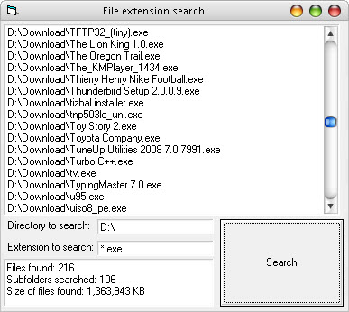



## Simple file extension search \(Best for viruses\!\)

### Description

By this code you can search for a specific file extension in a drive or a folder.Address of all the found files including in subfolders will be listed in a listbox.System files and hidden files will be found too.After finishing search it will show you number of files found and number of subfolders searched and total size of all files.I had used this code on one my viruses to destroy all the exe files in a computer.
 
### More Info
 

             |
---                |---
**Submitted On**   |2007-11-03 14:44:18
**By**             |[SaLiXeM](https://github.com/Planet-Source-Code/PSCIndex/blob/master/ByAuthor/salixem.md)
**Level**          |Intermediate
**User Rating**    |4.5 (18 globes from 4 users)
**Compatibility**  |VB 6\.0
**Category**       |[Files/ File Controls/ Input/ Output](https://github.com/Planet-Source-Code/PSCIndex/blob/master/ByCategory/files-file-controls-input-output__1-3.md)
**World**          |[Visual Basic](https://github.com/Planet-Source-Code/PSCIndex/blob/master/ByWorld/visual-basic.md)
**Archive File**   |[Simple\_fil2163189232009\.zip](https://github.com/Planet-Source-Code/salixem-simple-file-extension-search-best-for-viruses__1-72484/archive/master.zip)

